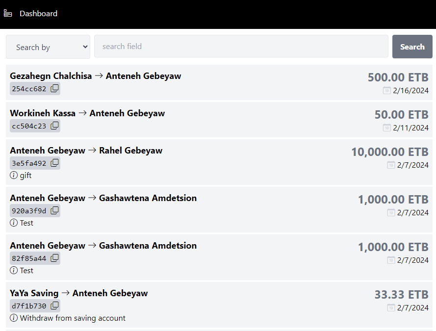
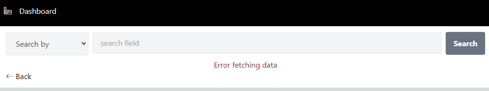

# dashboard-test-app
This Sample project contains: 
- List of transactions with pagination
- Search functionality

# How its implemented: 
- The app is build using Next js framework, typescript and tailwind css for styling. I have used Next js for securing the apis. Note that I have used Next js version 14.1.0 and Node 20.11.
- The app will fetch data from the provided api and will display the result as list.
- The pagination at the end of the list will fetch the data from the api as a page number is provided for the end point.
- The search functionality will use the end point to fetch the search result. it will display "No data Found" if there is no data.

Note: The search end point returning 200 but not providing any data.

Issues: The document provided for the api fetching the transaction data was not correct. It lacks a "/" char when encrypting the sign-in header.
I have provided that and was able to fetch the data successfully. 

# How to test the app in local development environment
git clone https://github.com/falamine/dashboard-test-app.git

npm install

npm run dev

Navigate to the url http://localhost:3000/

You can see how the page looks here: 

